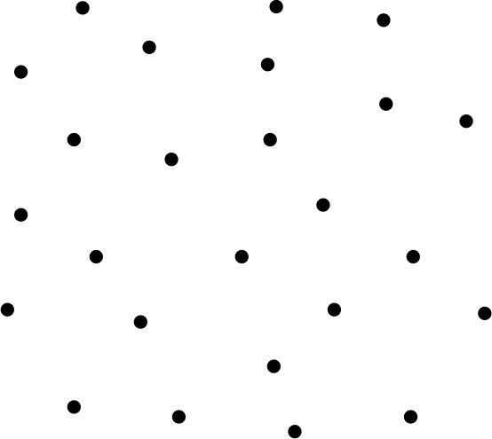
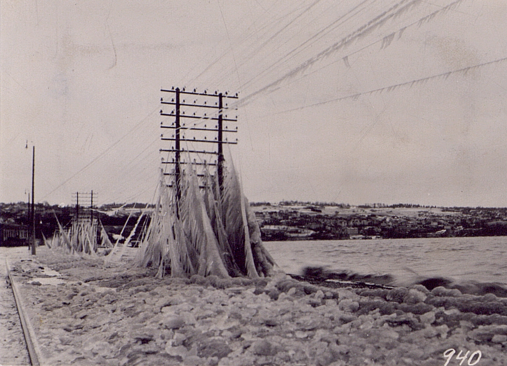
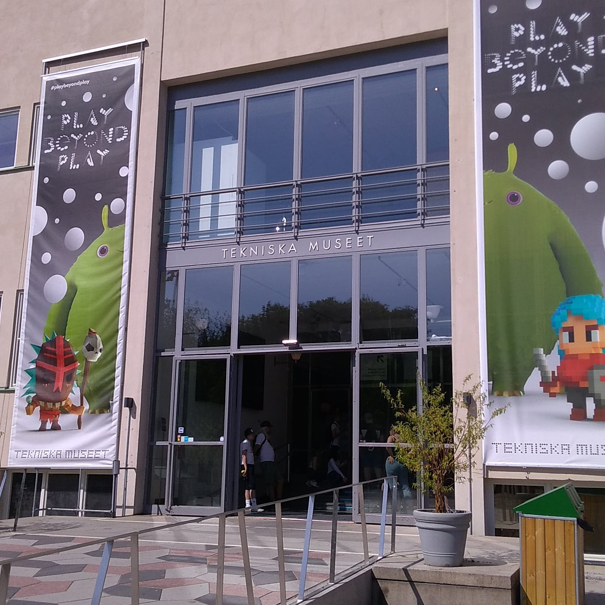

theme: Plain Jane, 2
footer: Kenji Rikitake / oueees 20210622 topic02
slidenumbers: true
autoscale: true

# oueees-202106 topic 02:
# [fit] Centralized communication

<!-- Use Deckset 2.0, 16:9 aspect ratio -->

---

# Kenji Rikitake

22-JUN-2021
School of Engineering Science, Osaka University
On the internet
@jj1bdx

Copyright ©2018-2021 Kenji Rikitake.
This work is licensed under a [Creative Commons Attribution 4.0 International License](https://creativecommons.org/licenses/by/4.0/).

---

# CAUTION

Osaka University School of Engineering Science prohibits copying/redistribution of the lecture series video/audio files used in this lecture series.

大阪大学基礎工学部からの要請により、本講義で使用するビデオ/音声ファイルの複製や再配布は禁止されています。

---

# Lecture notes and reporting

* <https://github.com/jj1bdx/oueees-202106-public/>
* Check out the README.md file and the issues!
* Keyword at the end of the talk
* URL for submitting the report at the end of the talk

---

# Topic of this video:
# [fit] Centralized communication

---

# Communication: sharing a medium

* Sharing a physical link between two or multiple parties
* *The physical layer*
* A medium could be: electric wires, optic fibers, radio airwaves, sound, flying birds like pigeons

---

# Connecting unconnected nodes

There are many ways to connect the dots in this picture

---

# Simplest way: star/centralized connection

- Centralized connection was the easiest way to connect the nodes
- Very much susceptible to network link failures
- Links should stay connected during the connection

---

# The old Stockholm telephone tower in 1890

` `

---

# Fallen telephone lines by frost at Jönköping, Sweden, 1929

` `

---

# Tekniska museet in Stockholm
## (June 2018)

` `

---

# Photo and image credits

* All photos and images are modified and edited by Kenji Rikitake
* Photos are from Unsplash.com unless otherwise noted

<!-- Photo and image credits here -->

* Stockholm telephone tower: [Tekniska museet](https://www.flickr.com/photos/tekniskamuseet/6838150900/in/album-72157629589461917/), from Flickr, CC BY 2.0
* Jönköping telephone lines: [Tekniska museet](https://www.flickr.com/photos/tekniskamuseet/6978810049/in/album-72157629575713829/), from Flickr, CC BY 2.0
* Tekniska museet photo: Kenji Rikitake, CC BY 4.0

<!--
Local Variables:
mode: markdown
coding: utf-8
End:
-->
