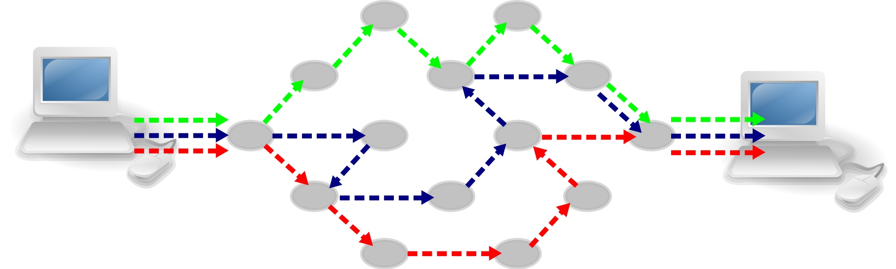
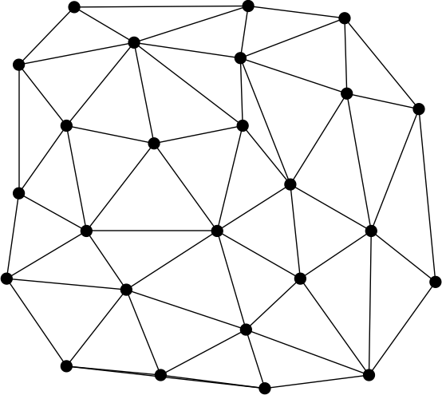

theme: Plain Jane, 2
footer: Kenji Rikitake / oueees 20210622 topic04
slidenumbers: true
autoscale: true

# oueees-202106 topic 04:
# [fit] Packet switching

<!-- Use Deckset 2.0, 16:9 aspect ratio -->

---

# Kenji Rikitake

22-JUN-2021
School of Engineering Science, Osaka University
On the internet
@jj1bdx

Copyright ©2018-2021 Kenji Rikitake.
This work is licensed under a [Creative Commons Attribution 4.0 International License](https://creativecommons.org/licenses/by/4.0/).

---

# CAUTION

Osaka University School of Engineering Science prohibits copying/redistribution of the lecture series video/audio files used in this lecture series.

大阪大学基礎工学部からの要請により、本講義で使用するビデオ/音声ファイルの複製や再配布は禁止されています。

---

# Lecture notes and reporting

* <https://github.com/jj1bdx/oueees-202106-public/>
* Check out the README.md file and the issues!
* Keyword at the end of the talk
* URL for submitting the report at the end of the talk

---

# Topic of this video:
# [fit] Packet switching

---


# Packet switching

What if you can split a stream into the *packets* and let them be delivered through *different links* for each packet?

---

# How to form a packet (1/2)

* Split a stream into multiple pieces of data

```
ABCDEFHIJ -> ABC DEF HIJ
```

* Put a header on each piece

```
ABC DEF HIJ -> P1-ABC P2-DEF P3-HIJ
```

---

# How to form a packet (2/2)

* Add source and destination addresses to each packet

```
P1-ABC P2-DEF P3-HIJ
 ->  FromXtoY-P1-ABC
     FromXtoY-P2-DEF
     FromXtoY-P3-HIJ
```

* Then send them on the network!

---

<!-- animated gif -->
[.background-color: #FFFFFF]


---

# Packet switching and the nodes

* Each communication node must know how to assemble/disassemble information to/from the packets
* Each communication node must know which link should be used to send a packet for the given destination
* Packets can be lost; relaying nodes cannot detect a lost packet

---

# Packet (dis)assembly issues

* The sequence of delivered packets may differ from that of the sender intents; holding the out-of-sequence packets are required
* Retransmission is required to recover a lost packet for a reliable communication

---

[.background-color: #FFFFFF]


---

# Packet switching enables

* Changing the packet relay routes *during* the communication
* Using multiple routes for a single communication link
* Aggregating multiple communication links into a physical link
* Connectionless *and* connection-oriented communication simultaneously

---



# Truly distributed networks are feasible by packet switching

* No centralized nodes
* Each link can be utilized by all nodes
* A disconnection of the link will not be fatal so long as one link is connected to a node

---

# Disadvantages of packet switching

* Each node must be able to form/generate and decode/interpret a packet
* Forming and decoding a packet takes time and the computing resources
* Reliability and latency can be a trade-off
* Relay nodes can be neutralized by denial-of-service attacks
* Difficult to manage

---

# Photo and image credits

* All photos and images are modified and edited by Kenji Rikitake
* Photos are from Unsplash.com unless otherwise noted

<!-- Photo and image credits here -->

* Packet Switching animated GIF: [By Oddbodz from Wikimedia Commons](https://upload.wikimedia.org/wikipedia/commons/f/f6/Packet_Switching.gif), CC BY-SA 3.0
* Internet packet switching: [By Computer-blue.svg: OpenClipartderivative work: Pluke (Computer-blue.svg)](https://upload.wikimedia.org/wikipedia/commons/c/c0/CPT-internet-packetswitching.svg), via Wikimedia Commons, CC0 (Public Domain)

<!--
Local Variables:
mode: markdown
coding: utf-8
End:
-->
