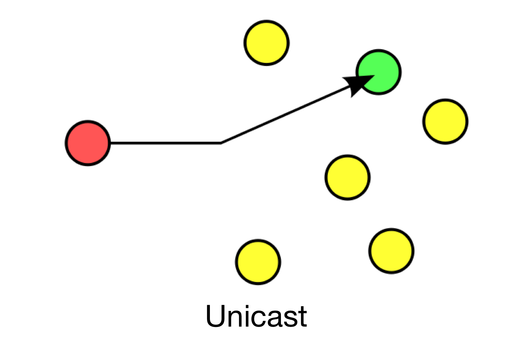
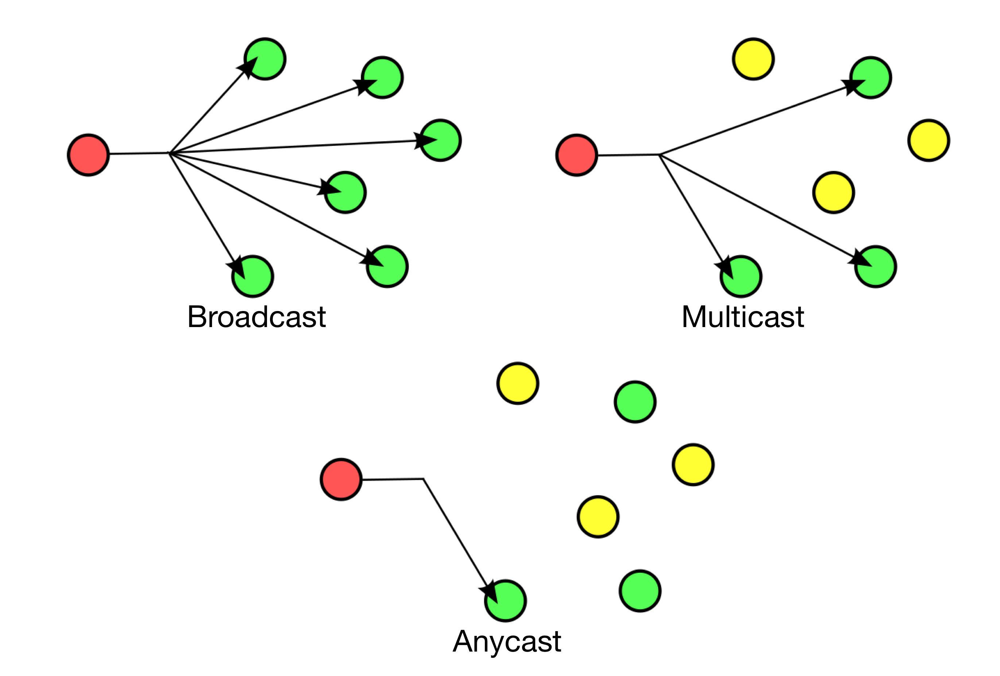

theme: Plain Jane, 2
footer: Kenji Rikitake / oueees 20210622 topic05
slidenumbers: true
autoscale: true

# oueees-202106 topic 05:
# [fit] Routing basics

<!-- Use Deckset 2.0, 16:9 aspect ratio -->

---

# Kenji Rikitake

22-JUN-2021
School of Engineering Science, Osaka University
On the internet
@jj1bdx

Copyright ©2018-2021 Kenji Rikitake.
This work is licensed under a [Creative Commons Attribution 4.0 International License](https://creativecommons.org/licenses/by/4.0/).

---

# CAUTION

Osaka University School of Engineering Science prohibits copying/redistribution of the lecture series video/audio files used in this lecture series.

大阪大学基礎工学部からの要請により、本講義で使用するビデオ/音声ファイルの複製や再配布は禁止されています。

---

# Lecture notes and reporting

* <https://github.com/jj1bdx/oueees-202106-public/>
* Check out the README.md file and the issues!
* Keyword at the end of the talk
* URL for submitting the report at the end of the talk

---

# Topic of this video:
# [fit] Routing basics

---

# Various aspects of routing

* Delivery
* Addresses
* Static or dynamic
* Route aggregation
* Security

---

# Delivery schemes

* Unicast
* Broadcast/Multicast/Anycast

---
[.background-color: #FFFFFF]

---
[.background-color: #FFFFFF]

---

# Photo and image credits

* All photos and images are modified and edited by Kenji Rikitake
* Photos are from Unsplash.com unless otherwise noted
* Unicast/broadcast/multicast/anycast diagrams: [By Easyas12c~commonswiki / Perhelion](https://en.wikipedia.org/wiki/Routing#/media/File:Cast.svg), via Wikimedia Commons, CC0 (Public Domain)

<!--
Local Variables:
mode: markdown
coding: utf-8
End:
-->
