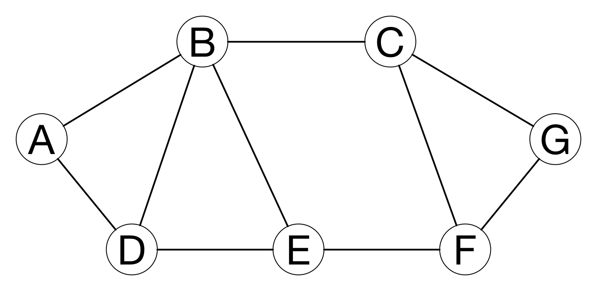
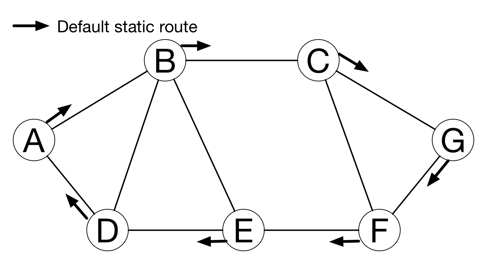
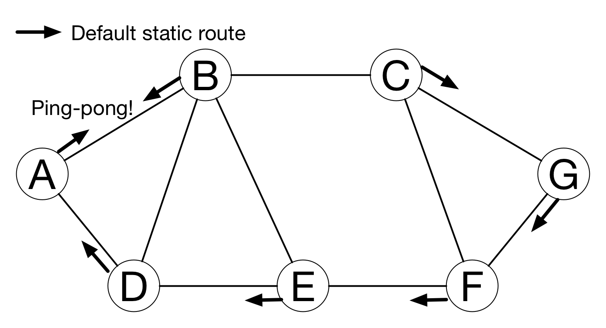
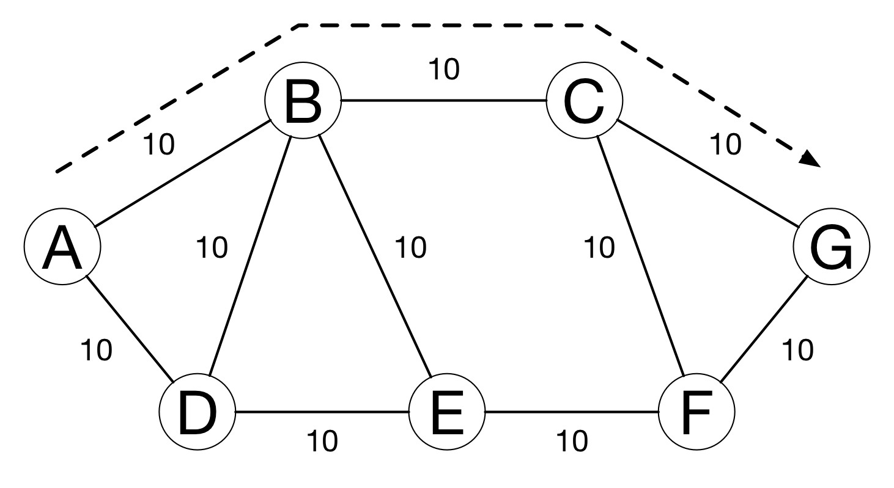
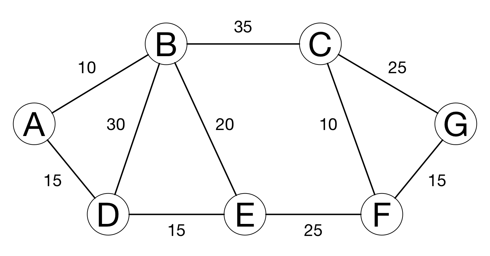
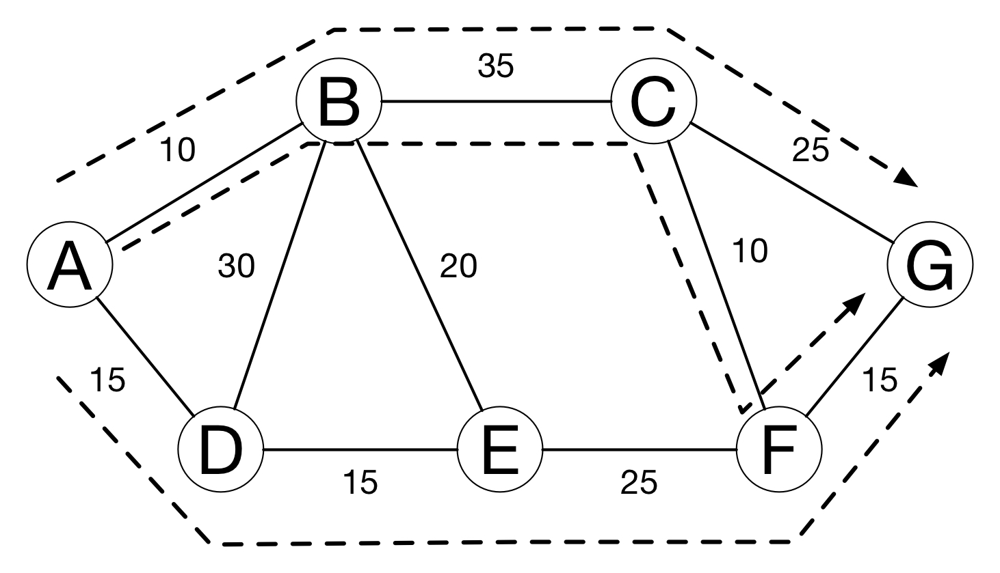
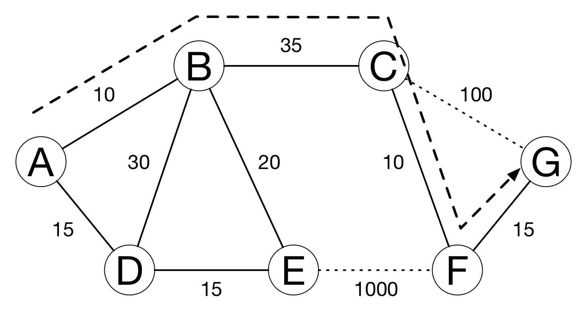
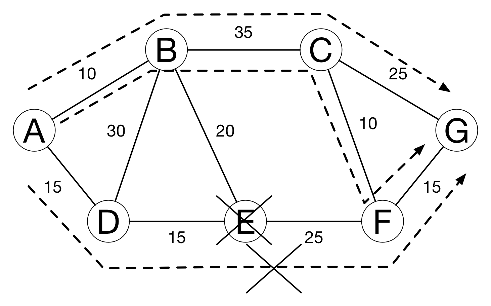

theme: Plain Jane, 2
footer: Kenji Rikitake / oueees 20210622 topic07
slidenumbers: true
autoscale: true

# oueees-202106 topic 07:
# [fit] Routing in details

<!-- Use Deckset 2.0, 16:9 aspect ratio -->

---

# Kenji Rikitake

22-JUN-2021
School of Engineering Science, Osaka University
On the internet
@jj1bdx

Copyright ©2018-2021 Kenji Rikitake.
This work is licensed under a [Creative Commons Attribution 4.0 International License](https://creativecommons.org/licenses/by/4.0/).

---

# CAUTION

Osaka University School of Engineering Science prohibits copying/redistribution of the lecture series video/audio files used in this lecture series.

大阪大学基礎工学部からの要請により、本講義で使用するビデオ/音声ファイルの複製や再配布は禁止されています。

---

# Lecture notes and reporting

* <https://github.com/jj1bdx/oueees-202106-public/>
* Check out the README.md file and the issues!
* Keyword at the end of the talk
* URL for submitting the report at the end of the talk

---

# Topic of this video:
# [fit] Routing in details

---

<!-- talk contents here -->
[.background-color: #FFFFFF]

---

# Static routing

- Set the default route for nodes which are not directly reachable
- Works well on simple networks or star networks
- Static routing may cause *ping-pong*

---
[.background-color: #FFFFFF]

---
[.background-color: #FFFFFF]

---

# Dynamic routing

- Hop count: count the hops between nodes
- Link cost: determined by the speed and quality
- Administrative policies

---

# Simple hop counting

- Assume every link costs the same with each other

---

[.background-color: #FFFFFF]

---

# Evaluating link cost

- What if the cost of each link varies?
- If two or more paths have the equal cost, all of the links will be utilized for load balancing

---
[.background-color: #FFFFFF]

---
[.background-color: #FFFFFF]

---

# Simulating link failures

- What if the link suddenly degrades or is disconnected?
- Largely increasing the cost of degraded or disconnected links will give an easy solution

---
[.background-color: #FFFFFF]

---

# Administrative policies

* For many reasons, you don't want to accept packets from some nodes, depending on the relay paths
* For example: passing C is OK, but passing E is not: A-B-C-G and A-B-C-F-G are OK, but A-D-E-F-G is blocked
* Common among interconnection of the autonomous systems (internet service providers and organizations)

---
[.background-color: #FFFFFF]

---

# Routing information dissemination protocols

* Link-state protocol: flooding link cost information of each node throughout the network
* Path vector protocol: exchanging path of nodes for each network instead of the link costs
* Highly vulnerable to external attacks

---

# Routing aggregation

- The following four networks
  * 192.168.100.0/24
  * 192.168.101.0/24
  * 192.168.102.0/24
  * 192.168.103.0/24
- -> aggregated as 192.168.100.0/22
- 4 networks together as one aggregated network

---

# Photo and image credits

* All photos and images are modified and edited by Kenji Rikitake
* Photos are from Unsplash.com unless otherwise noted

<!-- Photo and image credits here -->

<!--
Local Variables:
mode: markdown
coding: utf-8
End:
-->
