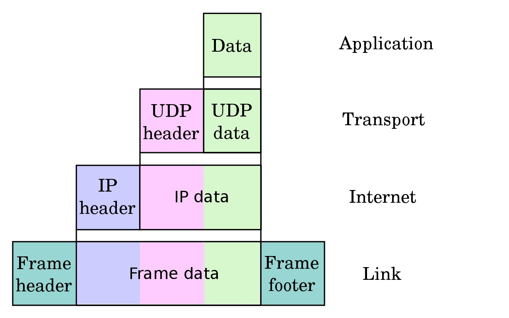

theme: Plain Jane, 2
footer: Kenji Rikitake / oueees 20210622 topic08
slidenumbers: true
autoscale: true

# oueees-202106 topic 08:
# [fit] Network transports

<!-- Use Deckset 2.0, 16:9 aspect ratio -->

---

# Kenji Rikitake

22-JUN-2021
School of Engineering Science, Osaka University
On the internet
@jj1bdx

Copyright ©2018-2021 Kenji Rikitake.
This work is licensed under a [Creative Commons Attribution 4.0 International License](https://creativecommons.org/licenses/by/4.0/).

---

# CAUTION

Osaka University School of Engineering Science prohibits copying/redistribution of the lecture series video/audio files used in this lecture series.

大阪大学基礎工学部からの要請により、本講義で使用するビデオ/音声ファイルの複製や再配布は禁止されています。

---

# Lecture notes and reporting

* <https://github.com/jj1bdx/oueees-202106-public/>
* Check out the README.md file and the issues!
* Keyword at the end of the talk
* URL for submitting the report at the end of the talk

---

# Topic of this video:
# [fit] Network transports

---

# IP address and the port number

* Each service has a 16-bit port number
* HTTPS = 443, DNS = 53, SSH = 22, etc.
* A pair of IP address and port number defines an endpoint of communication

---

# UDP and TCP

* Two major transport protocols on the internet
* User Datagram Protocol (UDP): connection-less
* Transport Control Protocol (TCP): connection-oriented

---

# Packet exchange limitation

* Packets are not always delivered
* Sending sequence is not preserved
* The same packet may be received multiple times
* The content of the packet may get altered or damaged
* Packet size has the limitation

---

# What UDP does

* Add a header with the port number
* Send it in an IP packet
* ... and that's it

---

---

# UDP's pros and cons

* UDP datagrams are still not always delivered and may get lost
* Sequence is not preserved
* The same datagram may be received multiple times and may cause duplicate delivery
* The errors in the contents of UDP datagrams are detectable
* UDP datagram has the size limit: suitable for relatively small messages
* Very small additional latency

---

# Transport control protocol (TCP)

* Detect packet loss by timeout
* Split stream into segments
* Put sequence numbers to the segments
* Reassemble segments to the stream
* Perform congestion control

---

---

# TCP's pros and cons

* Loss is detected and recovered so long as the connection is alive
* Sequence is preserved
* No content repetition
* Errors are detected and fixed by retransmission
* The stream will accept data so long as the connection is alive
* Data delivery may delay if retransmission occurs

---

# Web: HTTP/2 (TCP) and QUIC (UDP) -> HTTP/3

* People wants *speed* and *smaller latency*
* HTTP/2 (RFC7540): TCP-bound, stream aggregation and content compression
* QUIC (RFC9000): UDP-based, tightly integrated to HTTP/2 and specific congestion control
* HTTP/2 had *head-of-line blocking problem* by TCP
* Major browsers have already supported HTTP/3 (= HTTP/2 over QUIC)

---

# Buffering and head-of-line (HOL) blocking

* Buffering causes only the oldest packets to be forwarded
* Newer packets could be forwarded without HOL blocking
* In this example, moving buffers to output ports will avoid the delay for Output 3 at Input 1, blocked by the contention of Output 4

---

# Photo and image credits

* All photos and images are modified and edited by Kenji Rikitake
* Photos are from Unsplash.com unless otherwise noted
* UDP Encapsulation: [en:User:Cburnett original work, colorization by en:User:Kbrose, from Wikimedia Commons](https://commons.wikimedia.org/wiki/File:UDP_encapsulation.svg), CC BY-SA 3.0
* TCP Transport: [By Huage.chen from Wikimedia Commons](https://commons.wikimedia.org/wiki/File:Tcp_transport_example.gif), CC BY-SA 3.0
* Head-of-link Blocking: [By Moorcock from Wikipedia](https://en.wikipedia.org/wiki/File:HOL_blocking.png), Public Domain

<!-- Photo and image credits here -->

<!--
Local Variables:
mode: markdown
coding: utf-8
End:
-->
