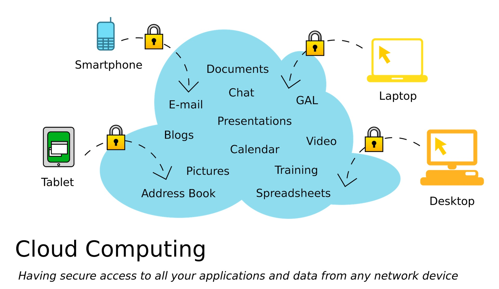
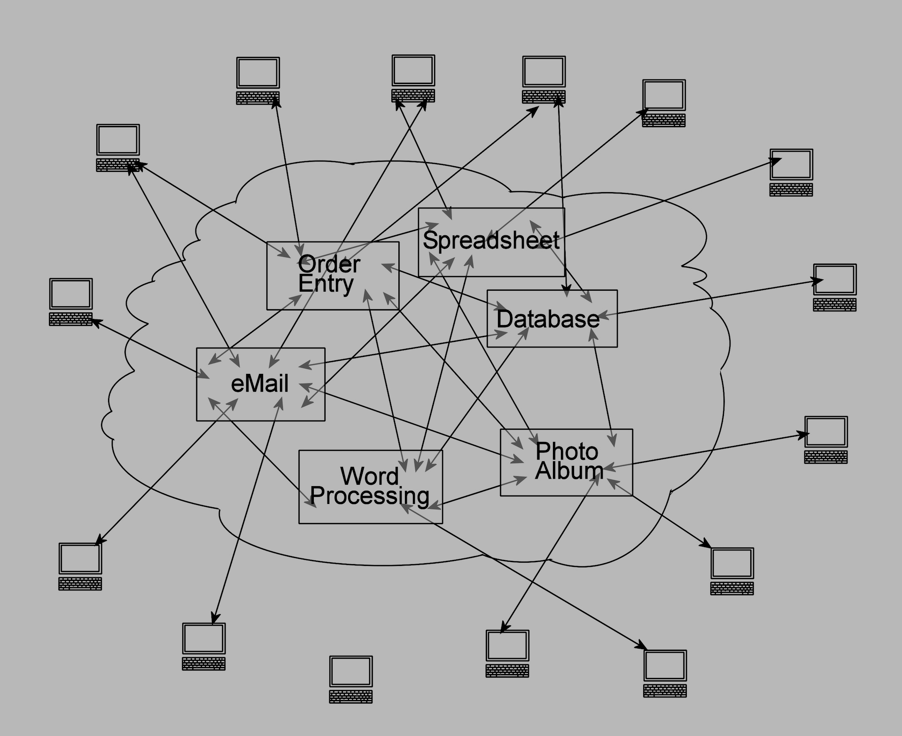
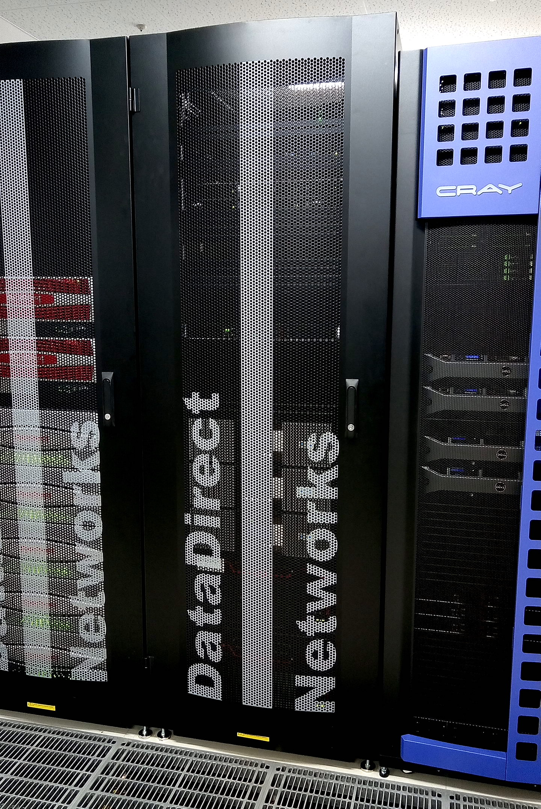
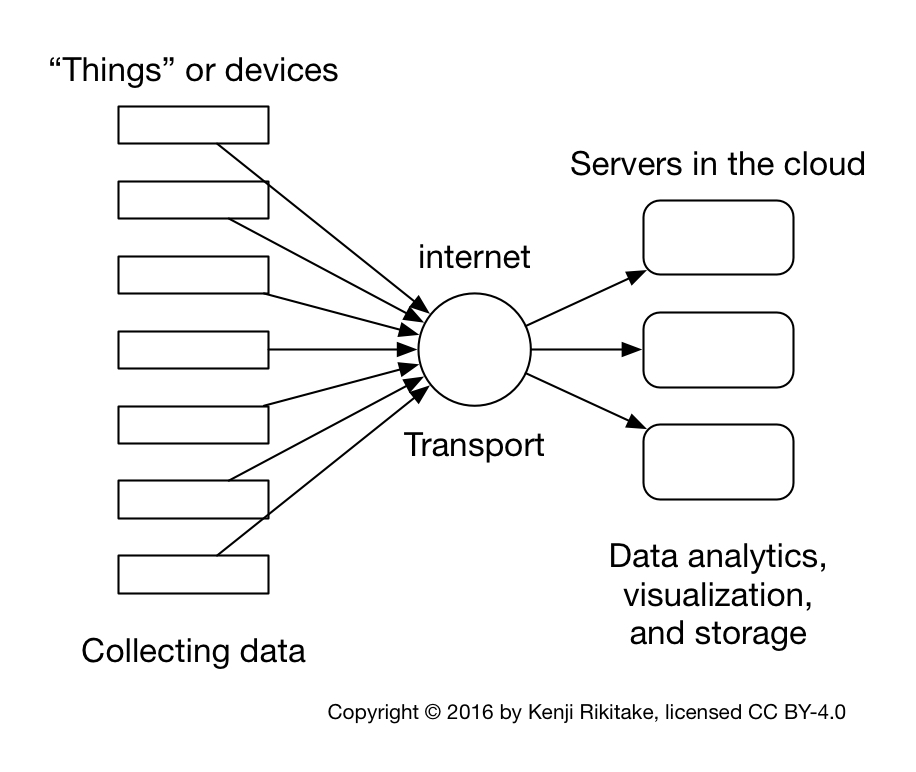

theme: Plain Jane, 2
footer: Kenji Rikitake / oueees 20210622 topic09
slidenumbers: true
autoscale: true

# oueees-202106 topic 09:
# [fit] Cloud computing basics

<!-- Use Deckset 2.0, 16:9 aspect ratio -->

---

# Kenji Rikitake

22-JUN-2021
School of Engineering Science, Osaka University
On the internet
@jj1bdx

Copyright ©2018-2021 Kenji Rikitake.
This work is licensed under a [Creative Commons Attribution 4.0 International License](https://creativecommons.org/licenses/by/4.0/).

---

# CAUTION

Osaka University School of Engineering Science prohibits copying/redistribution of the lecture series video/audio files used in this lecture series.

大阪大学基礎工学部からの要請により、本講義で使用するビデオ/音声ファイルの複製や再配布は禁止されています。

---

# Lecture notes and reporting

* <https://github.com/jj1bdx/oueees-202106-public/>
* Check out the README.md file and the issues!
* Keyword at the end of the talk
* URL for submitting the report at the end of the talk

---

# Topic of this video:
# [fit] Cloud computing basics

---

# Modern computing *is cloud computing*

---
[.background-color: #ffffff]

---

# Is cloud really a uniform and single entity?

---

# Absolutely not: it's an intertwined *network* of computers

---

# Web services are clusters of computers and networks

Thousands or millions of servers connected together

A physical server is separated into multiple virtual machines

---

# Cloud computing *is* centralization

---

# An example of cloud computing: Internet of Things (IoT) and telemetering

---

[.background-color: #ffffff]

---

# Telemetering

* Mostly unidirectional (not really *the true and genuine internet*)
* Sensors/devices gathering data through internet and feed them to the servers in the cloud computing platforms
* *The servers compute*
* *Extremely centralized*

---

# Photo and image credits

* All photos and images are modified and edited by Kenji Rikitake
* Photos are from Unsplash.com unless otherwise noted

* Modern Computing is Cloud Computing: Rayi Christian Wicaksono
* Cloud Computing: <https://commons.wikimedia.org/wiki/File:Cloud_applications_SVG.svg>, licensed under [Creative Commons CC0 1.0 Universal Public Domain Dedication](https://creativecommons.org/publicdomain/zero/1.0/deed.en)
* Intertwined network of computers: <https://en.wikipedia.org/wiki/File:Cloud_Computing.jpg>, licensed under [Creative Commons CC0 1.0 Universal Public Domain Dedication](https://creativecommons.org/publicdomain/zero/1.0/deed.en)
* Web services are clusters of computers: Kenji Rikitake, at Kyoto University ACCMS, April 2017

<!--
Local Variables:
mode: markdown
coding: utf-8
End:
-->
