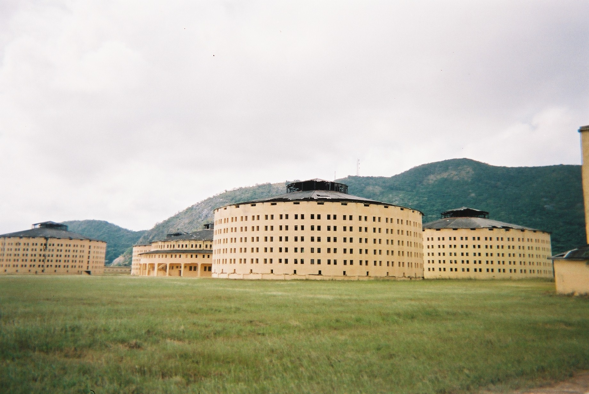
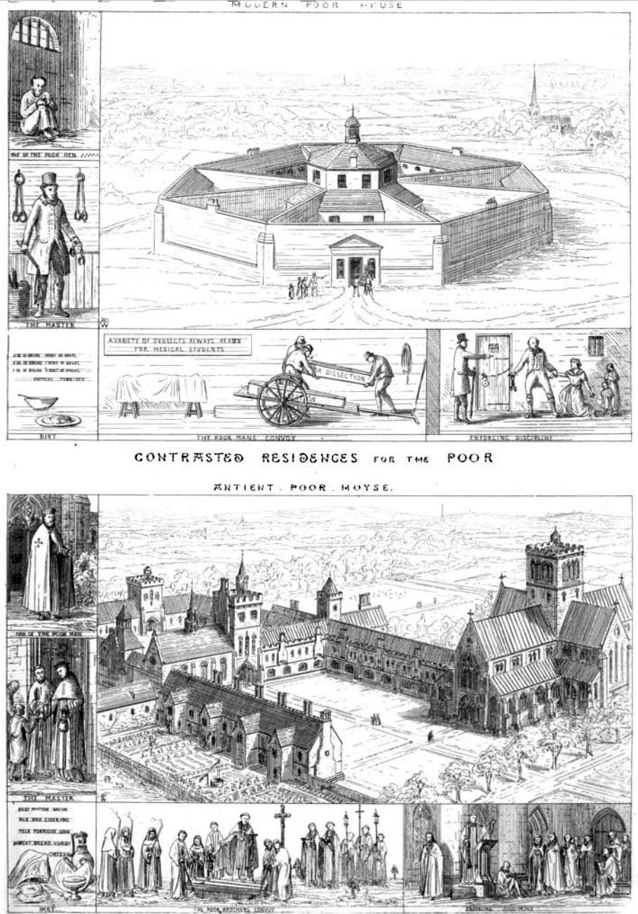
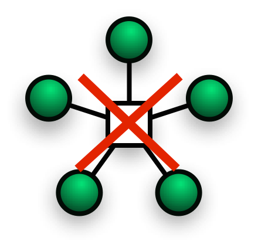

theme: Plain Jane, 2
footer: Kenji Rikitake / oueees 20210622 topic10
slidenumbers: true
autoscale: true

# oueees-202106 topic 10:
# [fit] Social implication of cloud computing

<!-- Use Deckset 2.0, 16:9 aspect ratio -->

---

# Kenji Rikitake

22-JUN-2021
School of Engineering Science, Osaka University
On the internet
@jj1bdx

Copyright ©2018-2021 Kenji Rikitake.
This work is licensed under a [Creative Commons Attribution 4.0 International License](https://creativecommons.org/licenses/by/4.0/).

---

# CAUTION

Osaka University School of Engineering Science prohibits copying/redistribution of the lecture series video/audio files used in this lecture series.

大阪大学基礎工学部からの要請により、本講義で使用するビデオ/音声ファイルの複製や再配布は禁止されています。

---

# Lecture notes and reporting

* <https://github.com/jj1bdx/oueees-202106-public/>
* Check out the README.md file and the issues!
* Keyword at the end of the talk
* URL for submitting the report at the end of the talk

---

# Topic of this video:
# [fit] Social implication of cloud computing

---

<!-- talk contents here -->
## Centralized social behavior accerelated by cloud computing

* Sharing *everything* - no privacy
* *Panopticon* [^1] style of governance, filtering, *censorship, or autocracy*
* Complete *externalization* of resources, leading to *no personal control*

[^1]: n. a circular prison with cells arranged around a central well, from which prisoners could at all times be observed. (New Oxford American Dictionary, Apple macOS 10.13.6)

---

# Presidio Modelo: a panopticon prison

---

[.background-color: #ffffff]

---

# INGSOC: the slogans [^2]

* War is peace
* Freedom is slavery
* Ignorance is strength

* Independent thinking = *thoughtcrime*

## NOTE: this is a *fiction*!

[^2]: George Orwell, "Nineteen Eighty-Four", 1949.

---

# Why cloud computing has become so *dystopian*? -- because we have sold freedom for *convenience*

* Ubiquitous/global accessibility
* Concentrated data for easy analysis
* Easy control of the information flow
* No extra cost for sharing
* No need to think about where the information locates

---

# The inconvenient truth of centralized systems: what if the core/cloud fails?

---

## Inconvenience of centralized systems

* Ubiquity or *no accessibility*
* When the core fails, no alternative
* When the core loses data, *no backup*
* The system performance is restricted by the capability of the core
* Endpoint systems will lost *all capabilities*

---

# Centralized systems are *not* sustainable

- ...then how cloud computing systems manages the sustainability?

---

# Distributed systems provide sustainability and resilience against failures

---

# Photo and image credits

* All photos and images are modified and edited by Kenji Rikitake
* Photos are from Unsplash.com unless otherwise noted

* Presidio Modelo Prison: By Friman [Public domain], from [Wikimedia Commons](https://commons.wikimedia.org/wiki/File:Presidio_Modelo.JPG)
* Panopticon: Jeremy Bentham, Public domain, via [Wikimedia Commons](https://commons.wikimedia.org/wiki/File:Panopticon.jpg)
* Contrasted Residences for The Poor: By Augustus Pugin [Public domain], via [Wikimedia Commons](https://commons.wikimedia.org/wiki/File:Contrasted_Residences_for_the_Poor.jpg)

<!--
Local Variables:
mode: markdown
coding: utf-8
End:
-->
