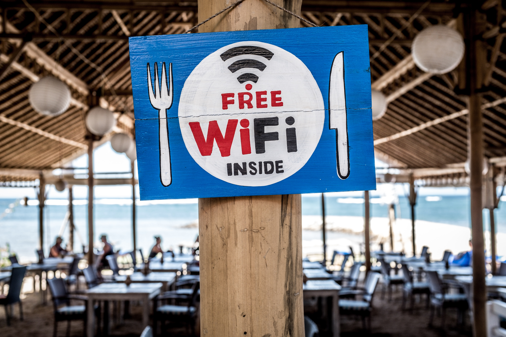

theme: Plain Jane, 2
footer: Kenji Rikitake / oueees 20210622 topic13
slidenumbers: true
autoscale: true

# oueees-202106 topic 13:
# [fit] Wireless/radio and internet

<!-- Use Deckset 2.0, 16:9 aspect ratio -->

---

# Kenji Rikitake

22-JUN-2021
School of Engineering Science, Osaka University
On the internet
@jj1bdx

Copyright ©2018-2021 Kenji Rikitake.
This work is licensed under a [Creative Commons Attribution 4.0 International License](https://creativecommons.org/licenses/by/4.0/).

---

# CAUTION

Osaka University School of Engineering Science prohibits copying/redistribution of the lecture series video/audio files used in this lecture series.

大阪大学基礎工学部からの要請により、本講義で使用するビデオ/音声ファイルの複製や再配布は禁止されています。

---

# Lecture notes and reporting

* <https://github.com/jj1bdx/oueees-202106-public/>
* Check out the README.md file and the issues!
* Keyword at the end of the talk
* URL for submitting the report at the end of the talk

---

# Topic of this video:
# [fit] Wireless/radio and internet

---

# [fit] Direct wired network at the maximum extent
# [fit] This is the old Stockholm telephone tower in 1890 (see Topic 02)

---

# [fit] Lessons learned: wired networks do not necessarily scale well

* Difficult to install, often impossible
* Easily get cut/disconnected by accidents
* Difficult to reconfigure/rewire
* Individual link management is complex and often erratically done

---

# [fit] Remove the wire!

---

# [fit] Wireless/radio networks
# [fit] as a replacement of wired networks

---

# Limitations of radio networks by physics

* Speed limited by radio frequency bandwidth
* Latency increased by (de)modulation and packetization
* Excessively large error rate due to obstacles (burst errors), fading, interference, and etc.: *Error-correction encoding required*
* Radiation spillover causes content disclosure: *encryption required*
* The source of interference is immensely difficult to locate
* Still requires a lot of wiring to the base stations

---

# [fit] Advantages of radio networks:
# [fit] Mobility

* Providing connections to where no wires can connect
* Nodes can move around while maintaining the connectivity

---

# [fit] Implementation issues to overcome for 5G era:
# [fit] Low channel capacity and short reachability 

* Trade-off between frequency bandwidth, reachable range, and base station installation
* Massive interference between nodes and networks
* Latency issues due to (de)modulation will persistently remain

---

# Photo and image credits

* All photos and images are modified and edited by Kenji Rikitake
* Photos are from Unsplash.com unless otherwise noted
* Free Wifi Inside: [Photo by Bernard Hermant](https://unsplash.com/photos/X0EtNWqMnq8)
* Pedestrians: [Photo by Ryoji Iwata](https://unsplash.com/photos/IBaVuZsJJTo)

<!--
Local Variables:
mode: markdown
coding: utf-8
End:
-->
