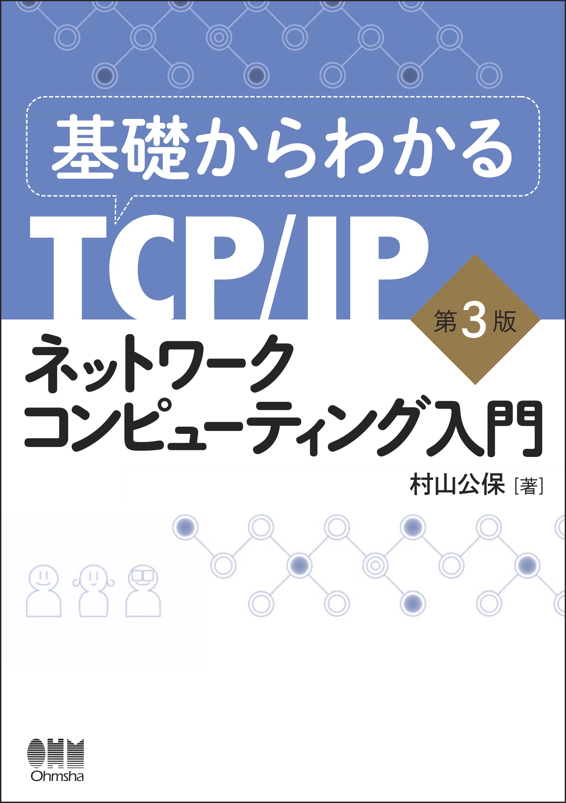
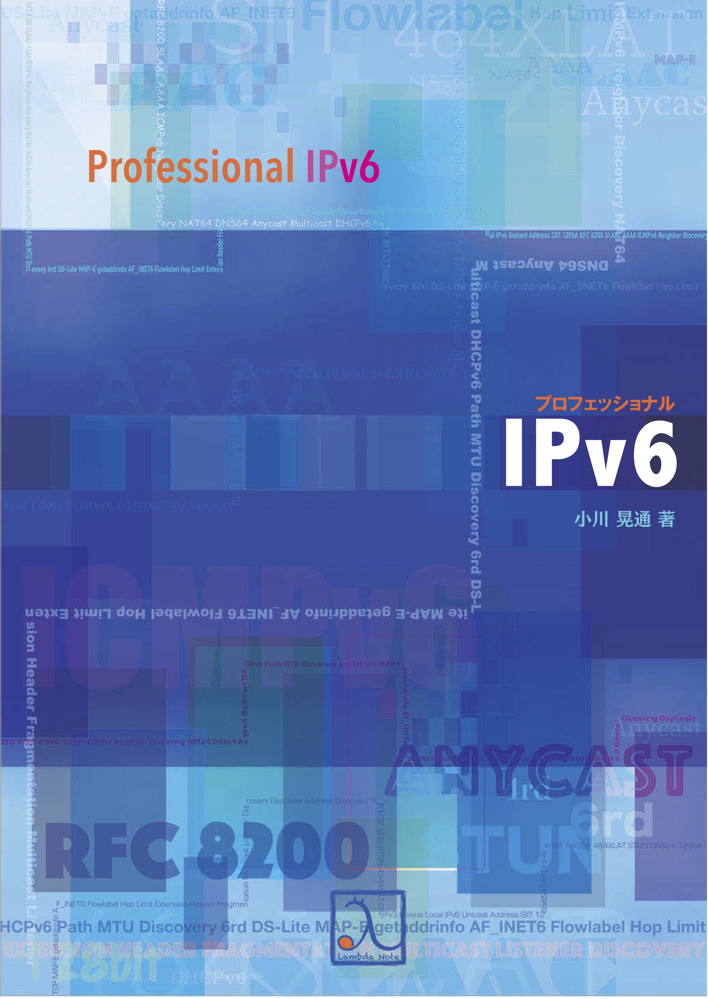

theme: Plain Jane, 2
footer: Kenji Rikitake / oueees 20210622 topic14
slidenumbers: true
autoscale: true

# oueees-202106 topic 14:
# [fit] Reference for further study

<!-- Use Deckset 2.0, 16:9 aspect ratio -->

---

# Kenji Rikitake

22-JUN-2021
School of Engineering Science, Osaka University
On the internet
@jj1bdx

Copyright ©2018-2021 Kenji Rikitake.
This work is licensed under a [Creative Commons Attribution 4.0 International License](https://creativecommons.org/licenses/by/4.0/).

---

# CAUTION

Osaka University School of Engineering Science prohibits copying/redistribution of the lecture series video/audio files used in this lecture series.

大阪大学基礎工学部からの要請により、本講義で使用するビデオ/音声ファイルの複製や再配布は禁止されています。

---

# Lecture notes and reporting

* <https://github.com/jj1bdx/oueees-202106-public/>
* Check out the README.md file and the issues!
* Keyword at the end of the talk
* URL for submitting the report at the end of the talk

---

# Topic of this video:
# [fit] Reference for further study

---

# 基礎からわかるTCP/IPネットワークコンピューティング入門 第3版

- オーム社 ISBN 9784274050732
- [達人出版会の電子書籍](https://tatsu-zine.com/books/kiso-tcpip-nwcp3)

---

# プロフェッショナルIPv6

- [ラムダノートの紙の本+電子書籍](https://www.lambdanote.com/products/ipv6)
- [Boothの無料版](https://professionalipv6.booth.pm/items/913273)

<!--
Local Variables:
mode: markdown
coding: utf-8
End:
-->
